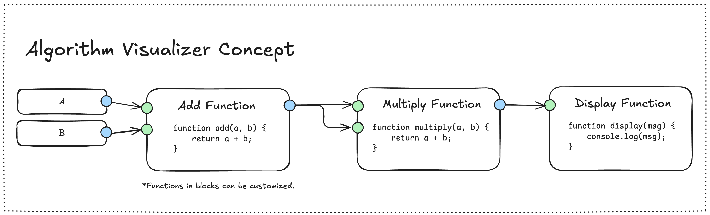

# Algorithm Visualizer

A block algorithm is a project that allows you to create blocks with your own specific functions, which can be plugged and played with other blocks.

## Todo List

- [ ] Implement `BasedBlock` class
- [ ] Implement connection between blocks
- [ ] Create test cases for `BasedBlock` class
- [ ] Implement Block UI component
- [ ] Implement Block Editor UI component

## Contributor

- [RuffLogix](https://www.github.com/rufflogix)
