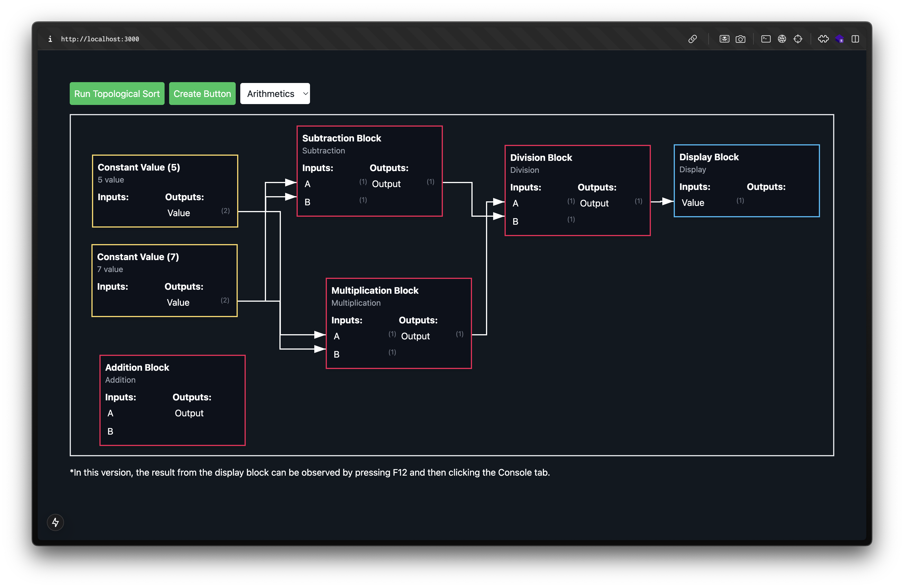

# Algorithm Visualizer


A block algorithm is a project that allows you to create blocks with your own specific functions, which can be plugged and played with other blocks.

### Block Structure

```
id: number;
x: number;
y: number;
name: string;
description: string;
nInputs: number;
nOutputs: number;
inputNames: string[];
outputNames: string[];
fn: Function;
style: string;
```

## Demo



## Todo List

- [x] `BasedBlock` class
- [x] Connection between blocks
- [ ] Test cases for `BasedBlock` class
- [x] Block UI component
- [x] Block Editor UI component
- [x] Create Block Button
- [ ] Delete Block Button
- [ ] Curve Connection
- [ ] Zoom In/Out
- [ ] Cancel Connection
- [x] Preset Blocks (Logic, Math, etc.)
- [ ] `console.log()` block for debugging
- [ ] Animation when block is running.
- [ ] Import/Export blocks data

## Contributor

- [RuffLogix](https://www.github.com/rufflogix)
